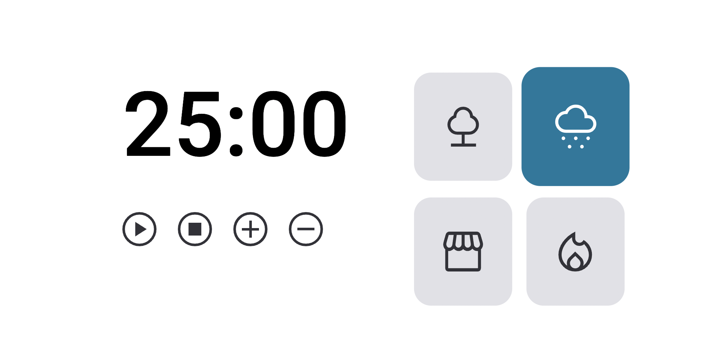

<h1 aling="center"> FocusTimer - Pomodoro </h1> 

 
    <a href="#-tecnologias">Tecnologias</a> &nbsp;&nbsp;&nbsp;|&nbsp;&nbsp;&nbsp;
    <a href="#-projeto">Projeto</a> &nbsp;&nbsp;&nbsp;|&nbsp;&nbsp;&nbsp;
    <a href="#-layout">Layout</a>

 

 Esse projeto é a primeira versão do desafio do stage 5, do explorer da RocketSeat

## 🚀 tecnologias

Esse projeto foi desenvolvido com as seguintes tecnologias:

- HTML

- CSS
 
- JavaScript 

## 💻 Projeto
 
Focus Timer foi desenvolvido com base no método pomodoro.

<strong>Funcionalidades:</strong> Quando acionado os botões de (+) e (-), diminui e adiciona 5 minutos. Os cartões do lado direito, tocam uma musica relaxante, o contador inicia em 25 minutos e quando acionado o botão de stop retorna para esses mesmo 25 minutos.

## 📱 Layout 

Você pode acessar-lo através desse <a href="https://focus-timer-v1.vercel.app/">Link </a>.